# PFCM Infrastructure Flow Documentation

> ระบบ PFCM (Production Facility Control Management) — i-Tail Corporation  
> สภาพแวดล้อม: Windows VM Production · PM2 · Node.js Cluster · React/Vite Dev Server · MSSQL · Redis  
> อัปเดต: พฤษภาคม 2569

---

## สารบัญ

1. [ภาพรวม Infrastructure](#1-ภาพรวม-infrastructure)
2. [Runtime Architecture Diagram](#2-runtime-architecture-diagram)
3. [Deployment Flow](#3-deployment-flow)
4. [Boot / Restart Flow](#4-boot--restart-flow)
5. [Request Lifecycle (HTTP)](#5-request-lifecycle-http)
6. [Frontend Serving Flow](#6-frontend-serving-flow)
7. [Backend Processing Flow](#7-backend-processing-flow)
8. [Database Connection Flow](#8-database-connection-flow)
9. [Redis & Socket.IO Flow](#9-redis--socketio-flow)
10. [PM2 Process Management Flow](#10-pm2-process-management-flow)
11. [Network Communication Flow](#11-network-communication-flow)
12. [Failure & Recovery Flow](#12-failure--recovery-flow)
13. [Logging & Monitoring Flow](#13-logging--monitoring-flow)
14. [Security Architecture](#14-security-architecture)
15. [Bottlenecks & Risk Points](#15-bottlenecks--risk-points)
16. [Recommended Improvements](#16-recommended-improvements)

---

## 1. ภาพรวม Infrastructure

### สภาพแวดล้อมการ Deploy

| องค์ประกอบ | รายละเอียด |
|---|---|
| **Platform** | Windows VM (On-Premise Factory Network) |
| **Server IP** | `172.48.0.115` |
| **Process Manager** | PM2 (ไม่มี Docker / Kubernetes) |
| **Frontend** | React 19 + Vite 5 — รัน Dev Server (ไม่ใช่ Static Build) |
| **Backend** | Node.js + Express — Cluster Mode |
| **Database** | MSSQL at `172.48.0.115:1433` |
| **Cache / PubSub** | Redis Windows Service at `172.48.0.115:6379` |
| **RFID Reader** | TCP Socket ที่ `10.246.145.182:49152` |
| **Reverse Proxy** | ไม่มี (ไม่มี Nginx / IIS เป็น Proxy) |

### Port Mapping

| Service | Port | Protocol |
|---|---|---|
| Backend API | `3000` | HTTP |
| Frontend Dev Server | `5173` | HTTP |
| Redis | `6379` | TCP |
| MSSQL | `1433` | TCP |
| RFID Reader | `49152` | Raw TCP |

---

## 2. Runtime Architecture Diagram

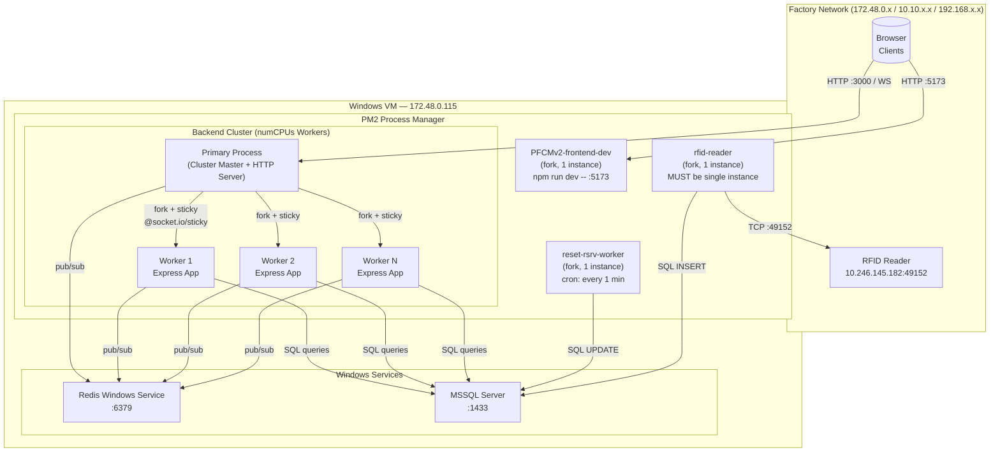

**หมายเหตุ:** Frontend ไม่ผ่าน Backend — Browser เชื่อมต่อ Frontend Dev Server (`:5173`) และ Backend API (`:3000`) โดยตรงแยกกัน

---

## 3. Deployment Flow

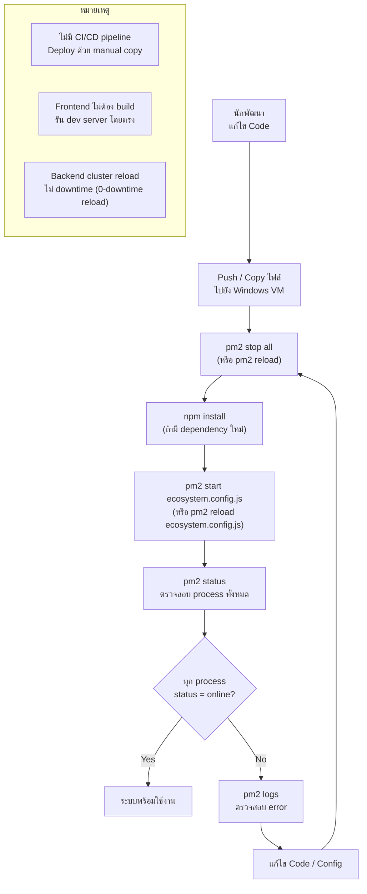

### ขั้นตอน Deploy ทีละขั้น

```
1. หยุด / Reload PM2:
   pm2 reload ecosystem.config.js --update-env

2. ตรวจสอบ:
   pm2 status
   pm2 logs PFCMv2-backend --lines 50

3. ถ้า reload ล้มเหลว:
   pm2 restart ecosystem.config.js

4. ตรวจสอบ Redis (Windows Service):
   services.msc → Redis → Ensure "Running"

5. ตรวจสอบ MSSQL:
   services.msc → SQL Server → Ensure "Running"
```

---

## 4. Boot / Restart Flow

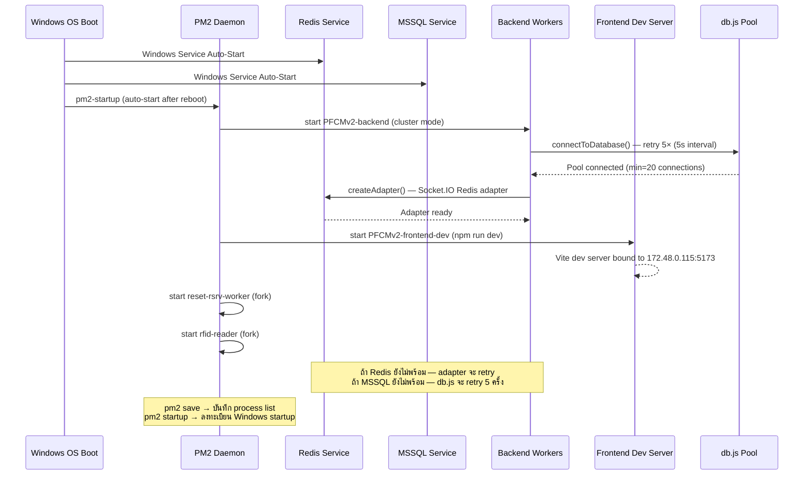

### Recovery หลัง Crash

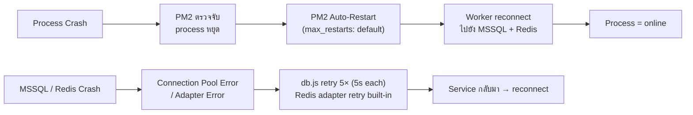

---

## 5. Request Lifecycle (HTTP)

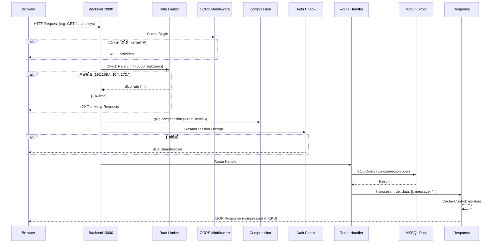

### Middleware Stack (เรียงลำดับ)

```
1. Compression (gzip level 6, threshold 1KB)
2. CORS (whitelist: 10.10.x.x, 192.168.x.x, 172.48.x.x)
3. Rate Limiter (3000 req/15min — skip internal IPs)
4. Body Parser JSON (limit: 5MB)
5. Body Parser URL-encoded (limit: 5MB, extended: true)
6. Cache-Control: no-store (all responses)
7. Static Files (ถ้ามี)
8. Route Handlers
9. Error Handler (catch-all)
```

---

## 6. Frontend Serving Flow

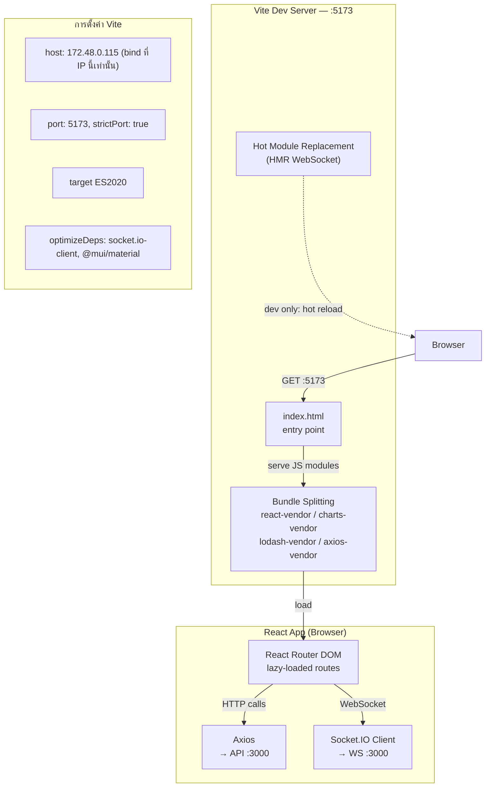

**หมายเหตุสำคัญ:** Frontend รันเป็น **Dev Server** (ไม่ใช่ production build) — หมายความว่า:
- Source maps พร้อมใช้งาน (อาจเปิดเผย source code)
- HMR WebSocket ทำงานในระบบ production
- Performance ต่ำกว่า static build ประมาณ 30-50%

---

## 7. Backend Processing Flow

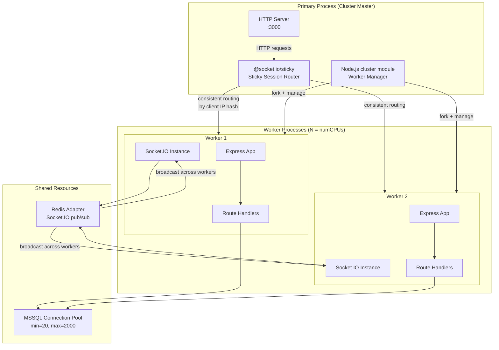

### ทำไมต้องมี Sticky Sessions?

Socket.IO ต้องการให้ client เชื่อมต่อ worker เดิมเสมอ เพราะ:
- WebSocket handshake เก็บ state ใน memory ของ worker นั้น
- ถ้า request ไปผิด worker → `sid not found` error → disconnect

`@socket.io/sticky` แก้ปัญหาโดย hash IP ของ client → routing ไปที่ worker เดิมเสมอ

---

## 8. Database Connection Flow

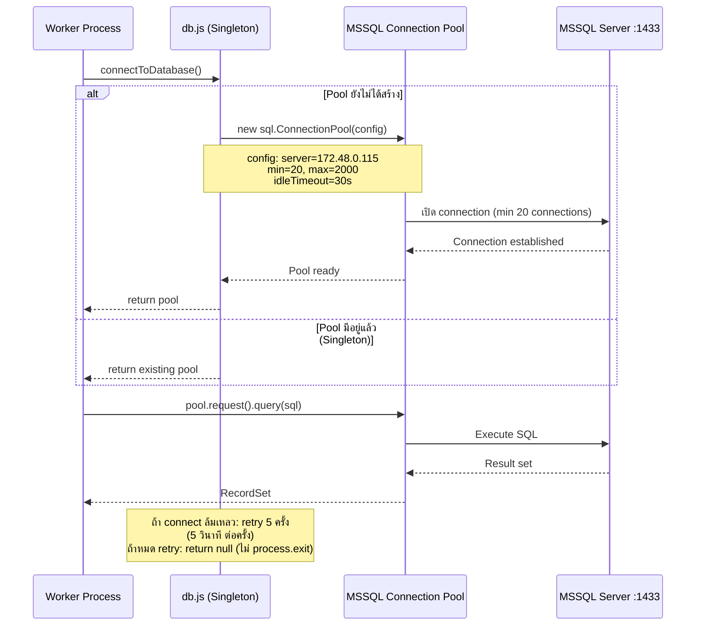

### การตั้งค่า Connection Pool

```
Pool Configuration:
  server:          172.48.0.115
  database:        [PFCM DB]
  port:            1433
  user:            [from env]
  password:        [from env]
  
  pool.min:        20   ← connections พร้อมใช้เสมอ
  pool.max:        2000 ← รองรับ load สูงสุด
  idleTimeout:     30,000 ms (30 วินาที)
  
  connectTimeout:  [default mssql]
  requestTimeout:  [default mssql]
```

**ความเสี่ยง:** `max=2000` สูงมาก — MSSQL อาจไม่รองรับ connections มากขนาดนี้พร้อมกัน

---

## 9. Redis & Socket.IO Flow

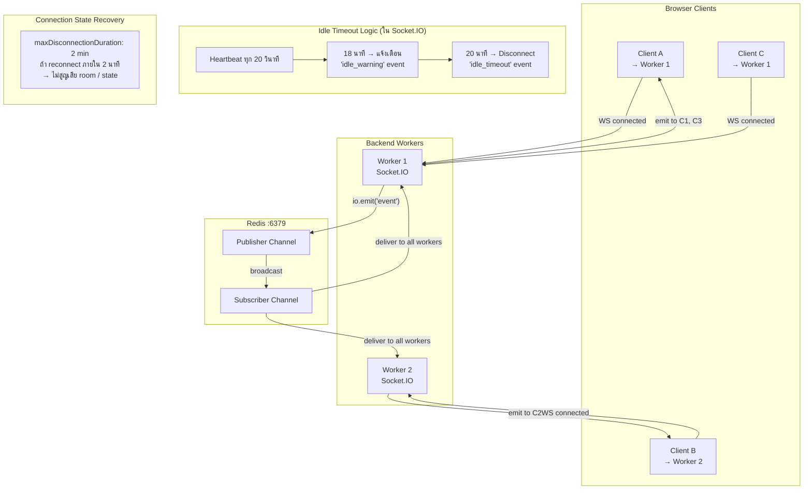

### Socket.IO Events ที่สำคัญ

| Event | ทิศทาง | ความหมาย |
|---|---|---|
| `idle_warning` | Server → Client | ใกล้ timeout (18 นาที) |
| `idle_timeout` | Server → Client | Disconnect เพราะ idle (20 นาที) |
| `user_activity` | Client → Server | รีเซ็ต idle timer |
| `ping` / `pong` | Socket.IO built-in | Heartbeat ทุก 20 วินาที |

---

## 10. PM2 Process Management Flow

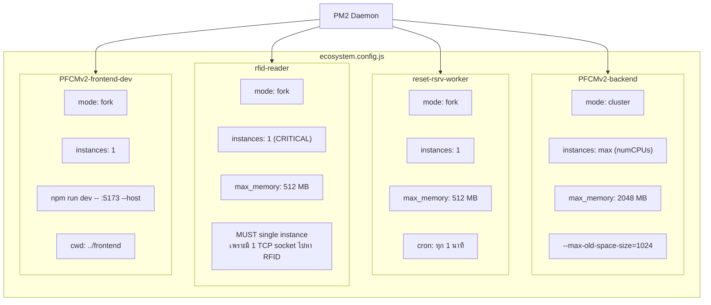

### PM2 Commands ที่ใช้บ่อย

```bash
# ดู status
pm2 status
pm2 monit

# Logs
pm2 logs PFCMv2-backend --lines 100
pm2 logs rfid-reader

# Reload (0-downtime สำหรับ cluster)
pm2 reload PFCMv2-backend

# Restart (มี downtime ชั่วขณะ)
pm2 restart all

# หลัง Windows reboot
pm2 resurrect   # ถ้าตั้ง startup แล้ว
# หรือ
pm2 start ecosystem.config.js
pm2 save
```

---

## 11. Network Communication Flow

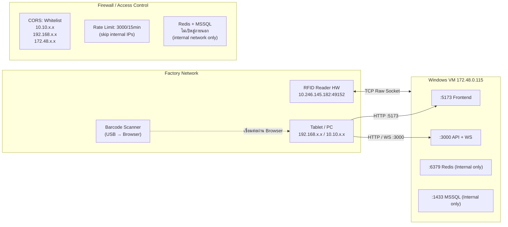

### การไหลของข้อมูล RFID

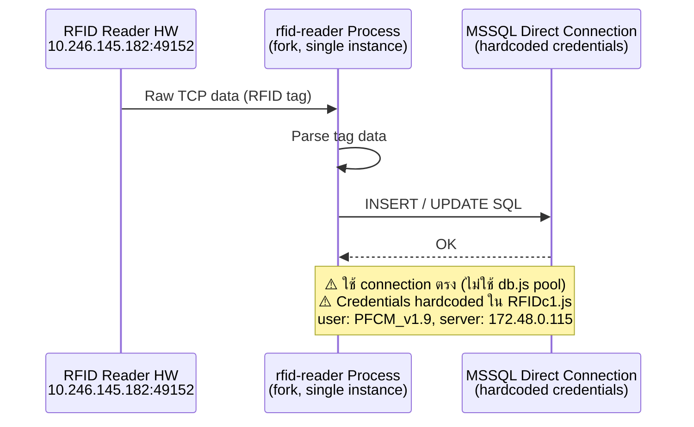

---

## 12. Failure & Recovery Flow

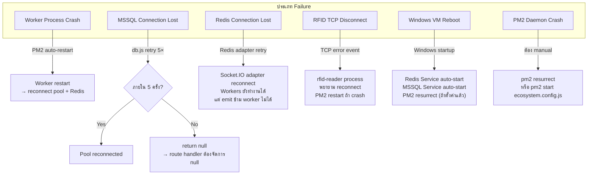

### Graceful Shutdown Flow

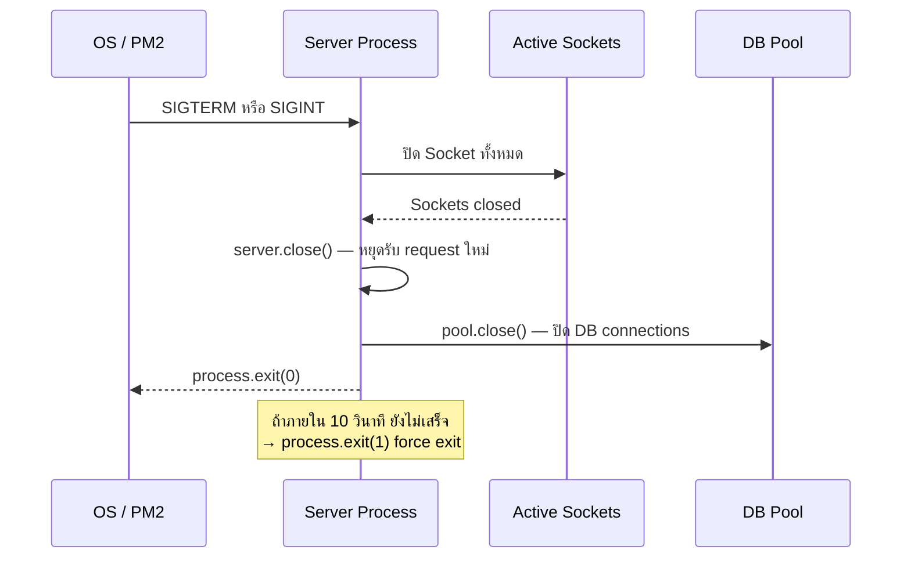

---

## 13. Logging & Monitoring Flow

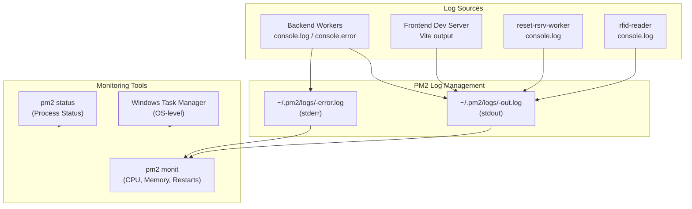

### Log Commands

```bash
# ดู log แบบ real-time
pm2 logs

# ดู log เฉพาะ app
pm2 logs PFCMv2-backend --lines 200

# ดู error เฉพาะ
pm2 logs PFCMv2-backend --err

# ล้าง log
pm2 flush

# Monitor CPU/Memory
pm2 monit
```

**ข้อจำกัด:** ไม่มีระบบ centralized logging (เช่น ELK, Datadog) — log อยู่ในไฟล์ local บน VM เท่านั้น

---

## 14. Security Architecture

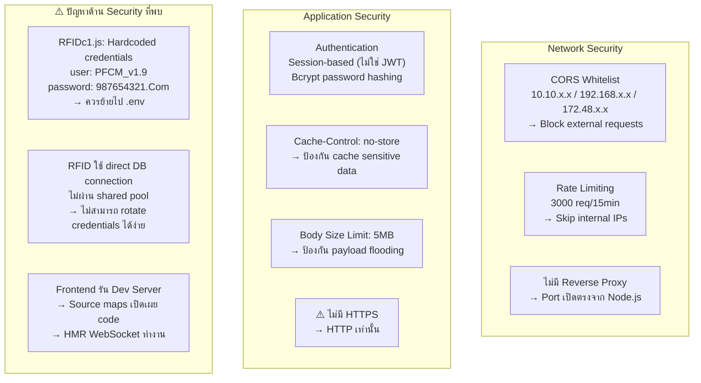

### Security Summary

| รายการ | สถานะ | ความเสี่ยง |
|---|---|---|
| CORS Whitelist | ✅ ดี | ต่ำ |
| Rate Limiting | ✅ ดี | ต่ำ |
| Bcrypt Passwords | ✅ ดี | ต่ำ |
| HTTPS | ❌ ไม่มี | สูง |
| Hardcoded Credentials | ❌ มีใน RFIDc1.js | สูง |
| Frontend Dev Server ใน Production | ⚠️ ควรเปลี่ยน | กลาง |
| JWT / Token-based Auth | ❌ ใช้ Session | กลาง |
| Centralized Secret Management | ❌ ไม่มี | กลาง |

---

## 15. Bottlenecks & Risk Points

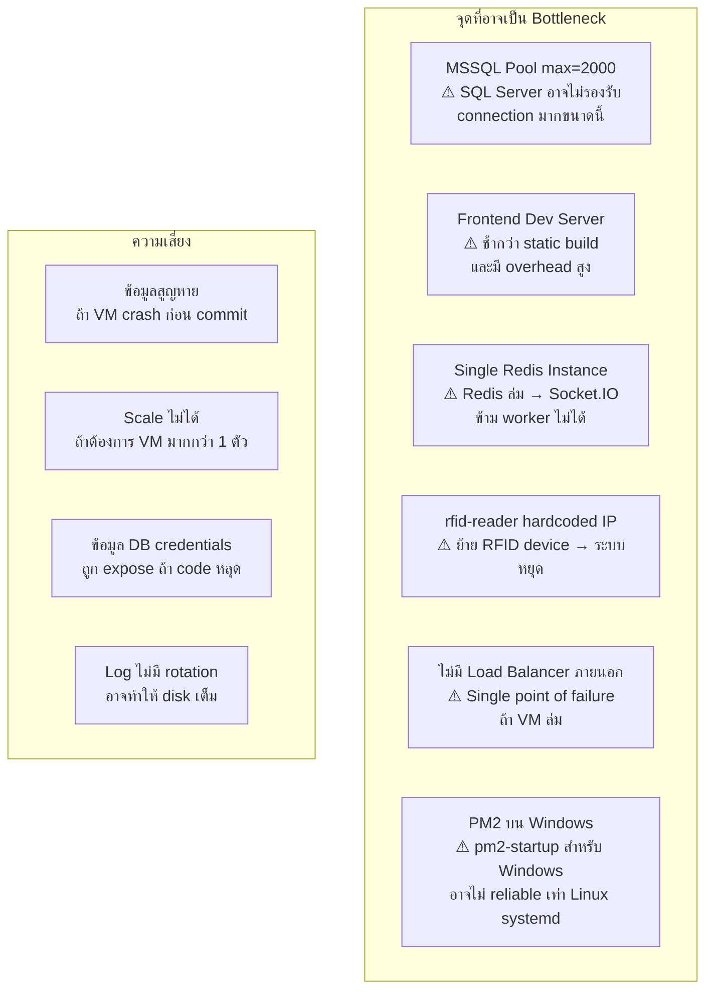

### ตาราง Risk Assessment

| ความเสี่ยง | ระดับ | ผลกระทบ |
|---|---|---|
| VM เดียว (no redundancy) | สูงมาก | ระบบทั้งหมดหยุด |
| Hardcoded DB credentials ใน RFIDc1.js | สูง | Credential leak |
| ไม่มี HTTPS | สูง | Data ถูก intercept |
| Frontend Dev Server ใน Production | กลาง | Performance + Source leak |
| Redis single instance | กลาง | Socket.IO cross-worker fail |
| Log ไม่มี rotation | กลาง | Disk เต็ม |
| Pool max=2000 | กลาง | MSSQL connection limit |
| ไม่มี DB backup automation | สูง | ข้อมูลสูญหายถาวร |

---

## 16. Recommended Improvements

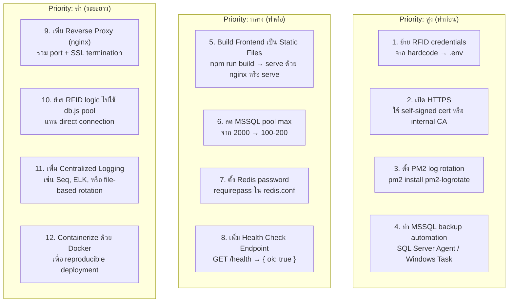

### Quick Wins (ทำได้ทันที)

```bash
# 1. ติดตั้ง PM2 log rotation
pm2 install pm2-logrotate
pm2 set pm2-logrotate:max_size 50M
pm2 set pm2-logrotate:retain 7
pm2 set pm2-logrotate:compress true

# 2. ตรวจสอบ PM2 startup (Windows)
pm2 startup
pm2 save

# 3. ทดสอบ Health (เพิ่มใน server.js)
# app.get('/health', (req, res) => res.json({ ok: true, uptime: process.uptime() }))
```

### แผนการย้าย Frontend เป็น Static Build

```
ปัจจุบัน:  PM2 รัน "npm run dev" → Vite Dev Server :5173
เป้าหมาย: npm run build → dist/ → serve ด้วย nginx หรือ "serve" package

ขั้นตอน:
1. npm run build (ใน frontend/)
2. npm install -g serve
3. serve -s dist -l 5173 --no-clipboard
4. อัป ecosystem.config.js: เปลี่ยน script จาก "npm run dev" → "serve -s dist -l 5173"

ประโยชน์:
- เร็วขึ้น ~50% (pre-bundled)
- ไม่มี source maps ใน production
- ไม่มี HMR overhead
- ลด memory ของ PM2 process นี้
```

---

## Appendix: สรุป IP และ Port ทั้งหมด

```
┌─────────────────────────────────────────────────────────┐
│              PFCM Network Map                           │
├─────────────────┬───────┬──────────┬────────────────────┤
│ Service         │ Host  │ Port     │ Protocol           │
├─────────────────┼───────┼──────────┼────────────────────┤
│ Backend API     │ VM    │ 3000     │ HTTP + WebSocket   │
│ Frontend        │ VM    │ 5173     │ HTTP               │
│ Redis           │ VM    │ 6379     │ TCP (internal)     │
│ MSSQL           │ VM    │ 1433     │ TCP (internal)     │
│ RFID Reader     │ remote│ 49152    │ Raw TCP            │
├─────────────────┼───────┼──────────┼────────────────────┤
│ Server VM       │ —     │ 172.48.0.115                  │
│ RFID Device     │ —     │ 10.246.145.182                │
│ Clients         │ —     │ 192.168.x.x / 10.10.x.x      │
└─────────────────┴───────┴──────────┴────────────────────┘
```

---
